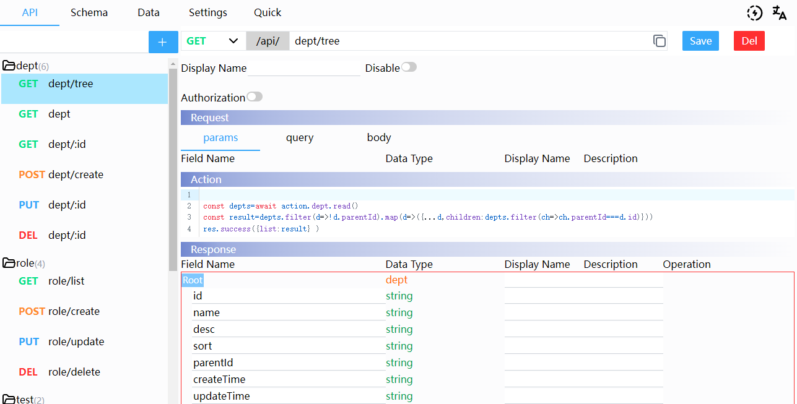

# API



## Authorization
You could enable and specialize a string here. The string would pass to the middleware.
When it enables , this route would add the auth middleware which runs before the action.
The auth middleware could be set in Settings API Section
## Request

- ### Params
  Input in url like /:key will add a param key field
- ### Query
  Could add `string` `number` `int` and it's `array` field
- ### Body
  Should input `Field Name` first , then choose a `Data Type`

## Action

Just think your code is in an Express js Route.

```ts
router.method("/url", async (req, res) => {
  /** your code comes here ... */
});
```

Obviously, you could use `req` to get the Request data ,and use `res` to send the Response 
   There two extra functions addon to `res`,which could be set in Settings API Section 
- `res.success()`  to send a success response  
- `res.error()`    to send a fail response  

There are also many Functions and npm libs which can be used here.

- Inner Function : `auto` (same as schema chapter)
- Inner Function : `action` (async function)

```ts
    /** SchemaName should replaced with real schema name */
    action.SchemaName.read()   //read the schema data file
    action.SchemaName.save(data:any) //save the schema data file

    /** array type data only */
    action.SchemaName.create(data:any) // add an item append to schema data array
    action.SchemaName.update(data:any) //update an item by primary field
    action.SchemaName.del(data:any) //delete an item by primary field
    action.SchemaName.detail(data:any) //get an item by primary field
    action.SchemaName.list(params:{page?: number; limit?: number} ) //get a paged list of schema data array

    action.SchemaName.batchCreate(data:any[]) // batch add items
    action.SchemaName.batchUpdate(data:any[]) // batch update items
    action.SchemaName.batchDel(data:any[]) // batch del items

```

- Third Party Npm Lib
  - @faker-js/faker (^8.3.1)
  - dayjs (^1.11.11)
  - mockjs (^1.1.0)
  - jsonwebtoken (^9.0.2)
  - svg-captcha ("^1.4.0")
  ```ts
  //create captcha
  const captcha = svgCaptcha.create({
    // ignoreChars:'abcdefghijklmnopqrstuvwxyz',
    charPreset: "0123456789",
    size: 4,
    noise: 3,
    color: true,
    background: "#f5f5f5",
  });
  res.json({ img: captcha.data });
  ```

## Response

At present ,it's only show what the response data structure is .
