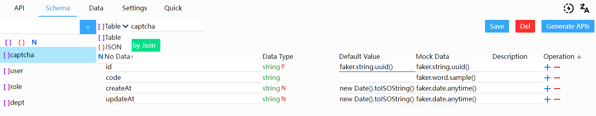

# Schema

There are two types of Data, Json Object `{}` , Json Array `[]`.
Where generate apis , it would be deferent by the Data type. 



## Schema Field

- Field Name
- Data Type
  - Basic : `string` `int` `number` `boolean` `object`
  - Ref :Refer to another Schema or Schema Field
  - Generate by Json : generate a `object` sub fields by json
- Default Value : Would run this code if not give the filed value
- Mock Data :Would run this code when batch generate Data.
- Description: Some info to note the field

#### `Default Value` and `Mock Data`

Could write a single line js code

- Inner Function : `auto`

```ts
auto.intId();
// auto increase , like 1 , 2 , 3 ...
auto.uuid();
// return a new uuid

// auto. stringId(prefix: string = '', length?: number)
auto.stringId("soon-", 4);
// auto increase , like 'soon-0001','soon-0002' , ...
```

- Third Party Npm Lib
  - @faker-js/faker (^8.3.1)
  - dayjs (^1.11.11)
  - mockjs (^1.1.0)

```ts
/**faker */
// could use any locale , like fakerFR , fakerAR ...
faker.number.int();
// Chinese (Simplified)
fakerZH_CN.person.jobTitle();

/**dayjs */
dayjs().format("YYYY-MM-DD");

/**mockjs */
mockjs.Random.url("http");
```
